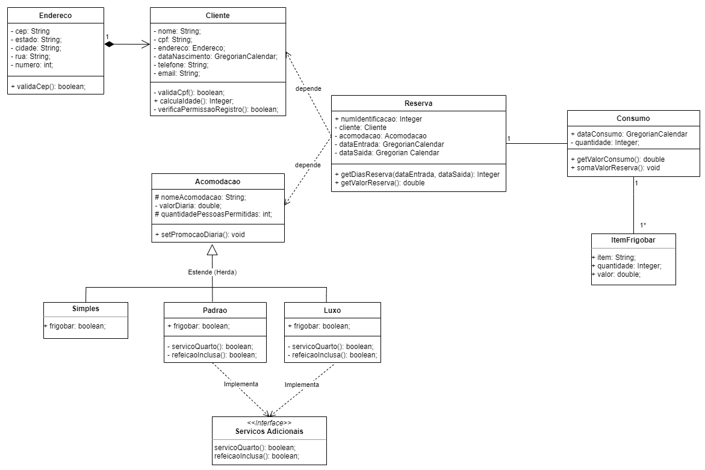

<h1 align="center">Gerenciador de Hotel</h1>

Este projeto consiste em um sistema de gerenciamento de um hotel para aplicar os conhecimentos da matéria de Programação Orientada a Objetos, ministrada pelo professor Paulo Roberto Miranda Meirelles na Universidade Federal do ABC.

  

<!--ts-->
   * [Features](#-Features)
   * [Pré Requisitos](#-Pré-requisitos)
   * [Como Instalar](#-Como-Instalar)
      * [Deploy Aplicação](#-Como-Instalar)
      * [Executando em Servidor Local](#Inicializando-o-TomCat)
      * [Possíveis Erros](#Você-pode-se-deparar-com-o-erro-UnsuportClassVersionError)
   * [Como Utilizar](#-Como-Utilizar)
   * [Construção](#-Construção)
   * [Testes](#-Testes)
   * [Tecnologias](#-Tecnologias)
   * [Autor](#-Autor)
<!--te-->

<h4 align="center"> 
	  Sistema de Hotelaria 🏨 
</h4>

### ✅ Features

- [x] Cadastro de Acomodações
- [x] Cadastro de Clientes
- [x] Cadastro de Reservas
- [x] Testes Automatizados
- [-] Tratamento de Erros (Em Andamento)
- [-] Responsividade (Em Andamento)

## ❗ Pré-requisitos

Antes de começar, você vai precisar ter instalado em sua máquina as seguintes ferramentas:
[Git](https://git-scm.com), [Java](https://nodejs.org/en/), [JDK](https://www.oracle.com/br/java/technologies/javase/javase-jdk8-downloads.html), [TomCat v9.0](https://tomcat.apache.org/download-90.cgi).

Além disto é bom ter um editor de código como o [Eclipse EE](https://www.eclipse.org/downloads/packages/release/kepler/sr2/eclipse-ide-java-ee-developers).

## 🖥 Como Instalar

### Baixe TomCat v9.0
Primeiro baixe o [TomCat v9.0](https://tomcat.apache.org/download-90.cgi). Em seguida extraia o mesmo.

### Clone este repositório
> $ git clone <https://github.com/Duarte64/sistemaHotel.git>

### Arquivo de Deploy
Pegue o arquivo gerenciadorHotel.war e jogue na pasta webapps do TomCat que você acabou de descompactar.

### Inicializando o TomCat
Abra um terminal na pasta do TomCat e execute os seguintes comandos:
> cd bin

> startup.bat (para windows)

> startup.sh (para linux)

### O servidor inciará na porta:8080 
- Acesse <http://localhost:8080> para verificar se o TomCat inicializou corretamente.
- Acesse <http://localhost:8080/cadastroAcomodacao.html> para entrar na aplicação.

### Você pode se deparar com o erro UnsuportClassVersionError
#### Solução para Windows
- Abra as propriedades do Este Computador
- Clique em Configurações Avançadas do Sistema e em seguida Variáveis de Ambiente
- Procure a variável JAVA_HOME (Caso ela não exista, crie uma nova com exatamente este nome) e edite para o seguinte caminho: C:/Aquivos-de-Programas/Java -> Aqui selecione o seu JDK, que deve ser igual ou superior a versão 10.0.0

## ⌨ Como Utilizar

### Para utilizar a ferramenta, realize os seguintes passos:

### Realize o Cadastro de Clientes 
É possível realizar quantos cadastros quiser. Após feito, você será redirecionado para a página de listagem de clientes, onde é possível consultar todos os cadastros, com a possibilidade de alterar as informações ou deletar os registros que julgar necessário.

### Realize o Cadastro de Acomodações
Definindo o seu respectivo tipo (Simples, Padrão e Luxo); É possível realizar quantos cadastros quiser. Após feito, você será redirecionado para a página de listagem de acomodações, onde é possível consultar todos os cadastros, com a possibilidade deletar os registros que julgar necessário.

### Registre Reservas. 
Será necessário unir um Cliente (com seu número de CPF) a uma Acomodação (pelo seu ID). Você deve definir a data de check-in e de check-out. Se o cadastro for bem sucessido e não for encontrado nenhum erro, você será redirecionado para a página de listagem de Reservas, onde irá mostrar as informações da reserva, a quantidade de dias da estadia e o valor da mesma.

### Observações
Ao consultar as reservas, você pode solicitar os diferentes serviços disponíveis para cada tipo de acomodação.
- As reservas de Acomodação Simples não possuem nenhum serviço adicional.
- As reservas de Acomodação Simples e Luxo tem os adicionais de Serviço de Quarto e Solicitar Refeição.
- A Acomodação de Luxo é a única que possui Serviço de Praia.

Ao solicitar um serviço, será exibida uma mensagem na tela. Se atente ao texto escrito, é possível reparar que para diferentes tipo de acomodação o texto irá muda.

## 🚀 Construção

### A aplicação foi construida seguindo as referências da seguinte UML.

<h1 align="center">
  
</h1>

## 👷⚙ Testes

#### Todos os testes foram feitos utilizando JUnit4, todos os modelos foram testados. Incluindo suas instâncias e tratamento de erros.
#### Você pode conferir todos os testes que foram construídos no package Testes

## 🛠 Tecnologias

As seguintes ferramentas foram usadas na construção do projeto:

- [Java](https://www.java.com/pt-BR/)
- HTML5
- CSS3

## 💻 Autores

### Gabriel Duarte 🧑‍💻
### Felipe Moreira ❤️💻
### Feito com ❤️ para a matéria de POO 👋🏽 Entre em contato!

 

 

